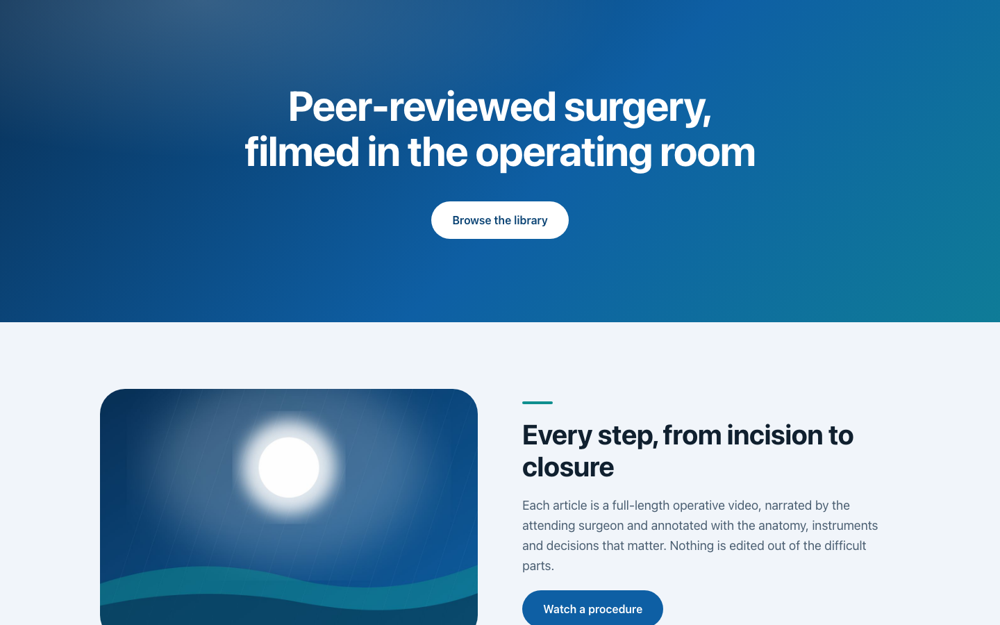
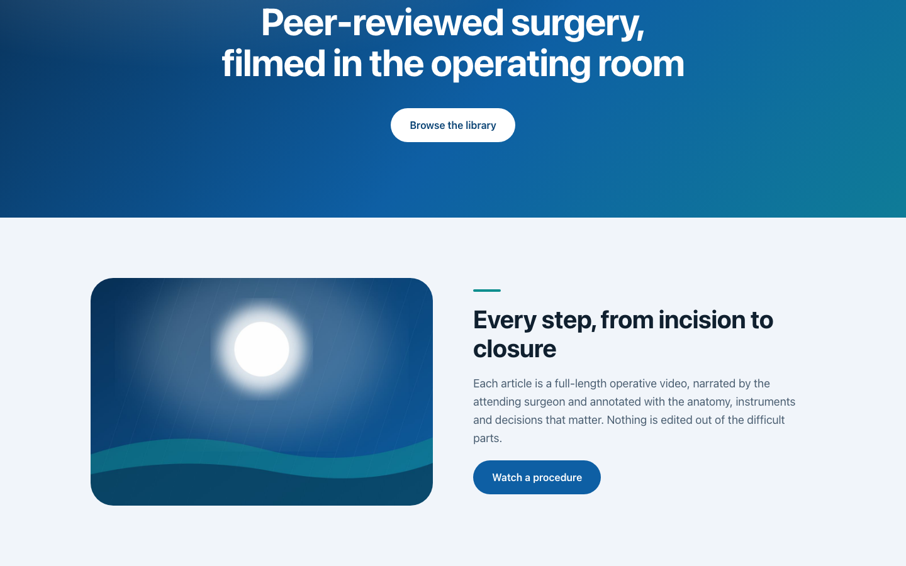
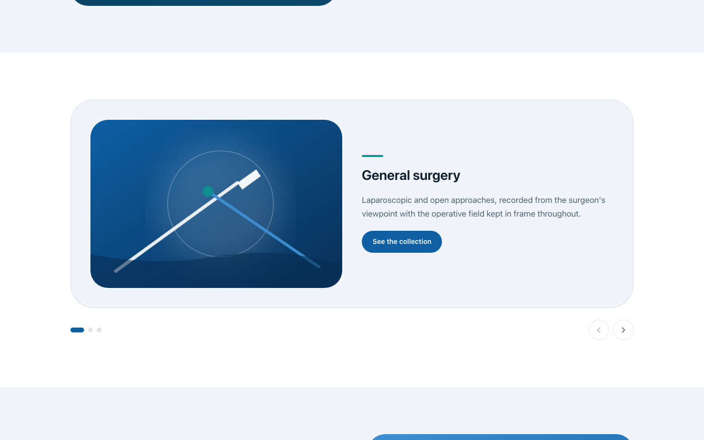
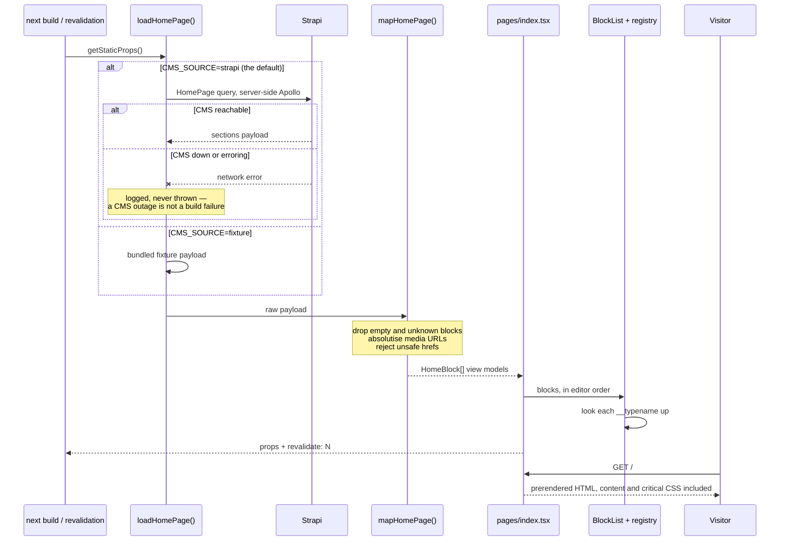

# JOMI Code Challenge — front-end

A Next.js 12 front-end that renders one Strapi page. The page is a **dynamic
zone**: an editor-ordered list of heterogeneous content blocks, so the
front-end cannot know its shape ahead of time and has to dispatch on each
block's GraphQL `__typename`.

Everything is prerendered. The HTML a visitor receives already contains the
content — no client-side query, no loading spinner, no CMS address or token in
the browser bundle.

The CMS half of the exercise, and the brief itself, live in
[`jomijournal/jomi-cms-challenge-backend`](https://github.com/jomijournal/jomi-cms-challenge-backend).
This repository is the front-end half only.

> **What is this repository's own.** `jomijournal/jomi-challenge-frontend` is a
> repository you fork, not an empty one: the Apollo plumbing, the codegen
> config, `graphql/types.tsx`, the Jest wiring and stubbed block components with
> `//TODO` markers all came with it. Sixteen of the fifty-seven tracked files
> outside `public/` and `docs/` descend from that starter, and one of them —
> `graphql/types.tsx`, 508 lines of codegen output from JOMI's schema — is
> untouched. Nothing outside the brief was invented: widening an interview
> exercise's scope only makes it harder to review.

## What the brief asked for

> "Fill-in the needed fields in the query on `homepage.graphql`. Run `yarn gen`
> … Complete components for `TwoColumnBlock`, `HeaderBlock`, `CarouselBlock` so
> that the front-end can properly render them."

| Asked for | Where it is |
| --- | --- |
| The field selections in `homepage.graphql` | [`graphql/cms/homepage.graphql`](graphql/cms/homepage.graphql) — all three `__typename`s plus the `Error` member the dynamic zone can carry |
| Regenerated types (`yarn gen`) | [`graphql/cms/homepage.generated.tsx`](graphql/cms/homepage.generated.tsx), committed so the app builds with no CMS present |
| `HeaderBlock`, `TwoColumnBlock`, `CarouselBlock` | [`components/blocks/`](components/blocks) |
| Selecting components by `__typename` | a registry rather than the suggested `switch` — see [Adding a block type](#adding-a-block-type) |

The three `__typename`s and every field name are the contract between the two
repositories. `ComponentCommonHeader`, `ComponentCommonTwoColumnBlock` and
`ComponentCommonCarousel`, and the attributes under each, match the backend's
`src/lib/blocks.js` exactly, and a test over there asserts them against the
schema JSON. The deepest path in the query — `homePage → data → attributes →
sections → Item → Image → data → attributes → url` — is nine levels, which is
what the CMS's GraphQL depth limit of 12 is sized against.

## Run it

```bash
docker compose up --build
# http://localhost:8261
```

That is the whole thing. The image is built against the bundled fixture
content, so the page is fully populated with no Strapi instance anywhere. Port
8261 rather than 3000, deliberately, so a locally running Next.js app is not
displaced.

To point it at a real CMS, put `CMS_SOURCE=strapi` and `STRAPI_URL` in a `.env`
next to `docker-compose.yml` and rebuild — the homepage is prerendered at build
time, so the source is chosen then.

Without Docker:

```bash
yarn install
cp .env.example .env     # defaults to CMS_SOURCE=fixture
yarn dev                 # http://localhost:8261
```

## What it renders

Captured by `yarn screenshots` — Playwright driving Chromium against the
production build on fixture content, so they reproduce without a CMS. Desktop
shots are 1440x900, mobile is 390x844.

| The homepage: Header Block over the first Two-Column Block | The same page at 390x844 |
| --- | --- |
|  |  |

| A Two-Column Block in full | The Carousel Block, on its first of three slides |
| --- | --- |
|  |  |

The artwork is generated, not stock photography — `scripts/generate-seed-art.mjs`
draws it from the theme palette, which keeps the repository free of licensing
questions.

## From the dynamic zone to HTML



**The browser gets no data layer.** `lib/cms/strapi.ts` — the Apollo client and
the GraphQL document — is reached through a dynamic `import()` taken only on the
Strapi branch inside `getStaticProps`, so it never enters the client module
graph. Nothing under `components/` imports Apollo, the generated types, or
`process.env`: dependencies point inward, at the plain view models in
`lib/cms/blocks.ts`.

**`revalidate` is the entire caching strategy.** One query, no user input,
nothing to paginate: the page is generated once and regenerated at most once per
window whatever the traffic, and an editor's change appears without a redeploy.
The window is `CMS_REVALIDATE_SECONDS`.

## Adding a block type

A dynamic zone is an open set — an editor can add a component type at any time —
which makes a `switch` on `__typename` the thing most likely to need editing
next, in two or three places at once.

Instead each block exports `defineBlock({ typename, component })` beside its
component, `components/blocks/blockRegistry.ts` collects those into a `Map`, and
`BlockList` looks each block up. A new block type is one new file plus one line
in that list. Two guards keep it honest:

- `ALL_BLOCK_TYPES_REGISTERED` is a compile-time completeness check. A member of
  the `HomeBlock` union with no component stops `next build` with the missing
  type named in the error.
- An unrecognised `__typename` at runtime is skipped with a development warning
  instead of throwing, because the CMS can always be ahead of a deploy and one
  unknown block must not take the page down.

`createBlockRegistry` also throws on a duplicate registration, which is tested.

## Treating CMS content as untrusted

Strapi's generated types are deeply optional and wrap media in an entity
response, so rendering straight from them pushes the same defaulting,
absolutising and sanitising into every component. `lib/cms/mapHomePage.ts` does
it once and hands the UI plain, non-optional view models. That single place is
also the trust boundary:

- Every CMS-supplied URL — button targets and image sources alike — goes through
  [`lib/safeHref.ts`](lib/safeHref.ts), which permits only `http:`, `https:`,
  `mailto:`, `tel:` and relative URLs and returns `null` otherwise, so the caller
  drops the link rather than rendering an unsafe `href`. An editor cannot store
  a `javascript:` URL that reaches an attribute.
- Root-relative upload paths, which is what Strapi's local provider returns, are
  absolutised against `STRAPI_CMS_URL`.
- Blocks with no usable content, unknown `__typename`s and the `Error` member of
  the union are dropped before the UI sees them.

## Environment

Every variable is read on the server only. `next.config.js` inlines nothing into
the browser bundle, so the CMS address and token never reach a visitor.

| Variable | Required | Default | What it does |
| --- | --- | --- | --- |
| `CMS_SOURCE` | no | `strapi` | `strapi` queries the live CMS. `fixture` renders the bundled payload in `lib/cms/fixtures.ts`, so the app builds and boots with no CMS running. Any other value is treated as `strapi`. |
| `STRAPI_URL` | when `CMS_SOURCE=strapi` | `http://localhost:1337/graphql` | GraphQL endpoint of the CMS. Falls back to the default with a development warning when unset. |
| `STRAPI_CMS_URL` | no | — | Origin of the Strapi instance. Its hostname is added to `images.domains` so `next/image` may load CMS media, and it is prefixed onto root-relative upload URLs. |
| `STRAPI_TOKEN` | no | — | Strapi API token, sent as `Authorization: Bearer …`. Unset means the public endpoint. |
| `CMS_REVALIDATE_SECONDS` | no | `60` | Seconds between ISR regenerations. A non-positive or unparseable value warns and falls back. |
| `SCREENSHOT_PORT` | no | `8261` | Port `yarn screenshots` starts the production server on. |

`.env.example` is the same list, annotated, with placeholders only.

## Working on it

```bash
yarn dev          # dev server on 8261          yarn lint        # ESLint + jsx-a11y + @typescript-eslint
yarn build        # production build            yarn typecheck   # tsc --noEmit, strict
yarn start        # serve that build            yarn test        # jest (add --watch, or a path fragment)
yarn screenshots  # redo docs/screenshots       yarn seed:art    # redraw public/seed
yarn gen          # regenerate GraphQL types from a live Strapi schema
```

`yarn gen` introspects the schema over the network at the URL in
`graphql.config.yml`, so Strapi must be running, and the file it writes carries
a header noting the two places it has since been hand-edited and why.

```
components/blocks/   registry.ts (the seam) + blockRegistry.ts (the wiring) +
                     BlockList and the three block components
components/ui/       CmsImage: next/image with a reserved box and per-breakpoint sizes
lib/cms/             blocks.ts (view models) · mapHomePage.ts (trust boundary) ·
                     homePage.ts (source + revalidate) · strapi.ts (server-only client) ·
                     fixtures.ts (deterministic sample payload, in Strapi's own shape)
theme/index.ts       typography, palette, focus ring, alternating section surfaces
pages/               _document.tsx (server-side Emotion extraction), _app.tsx, index.tsx
scripts/             screenshot capture, seed artwork, PNG optimiser
```

Tests sit in `__tests__` directories beside the code, except page tests: Next.js
treats every file under `pages/` as a route, so those live in `__tests__/pages/`.
`jest.setup.ts` installs a `fetch` stub that rejects loudly, so nothing can reach
the network, and stubs `IntersectionObserver`, which jsdom lacks and `next/image`
needs before it will swap in a real source.

```
$ yarn test
Test Suites: 13 passed, 13 total
Tests:       126 passed, 126 total
Time:        2.364 s
```

## Known gaps

- **One route.** The brief is the `homePage` single type, so there is no
  routing, no article page and no search.
- **The Docker image has not been built here.** `docker compose config` parses
  and the Dockerfile is maintained alongside the rest, but the image was never
  built or booted in this environment. Treat that path as reviewed, not
  smoke-tested.
- **No CSP.** MUI and Emotion inject styles at runtime, so a useful policy needs
  a nonce plumbed through `_document`. The other standard headers
  (`X-Content-Type-Options`, `X-Frame-Options`, `Referrer-Policy`,
  `Permissions-Policy`) are set in `next.config.js`, and `poweredByHeader` is
  off.
- **`yarn gen` needs a live Strapi**, and the committed generated file has been
  hand-edited twice. A schema change means regenerating against a running CMS.
- **The fixture is not the CMS.** It runs through the same `mapHomePage`
  pipeline, so it cannot drift from the real code path, but it cannot catch a
  schema change in Strapi either. Only `yarn gen` against the live schema does
  that.
- **The carousel has no auto-advance and no infinite loop.** It is a native
  scroll-snap track with labelled controls, which works with touch, trackpad and
  keyboard before any JavaScript runs — deliberate, but a difference from most
  marketing carousels. The CMS component carries no presentation settings at
  all, so every one of those choices is made here.
